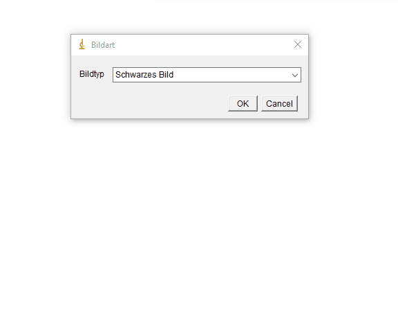

# GDM1
Painting filter in Basics of Digital Media, painting flags. 2nd semester, 1st-exercise, digital media

It was an exercise to mathematically create different pictures via Java Image generation,
shifting bits, modulo operations, and clever maths, conditions and loops.

There were different things to do, but I'll only show the flags here, as they were the toughest to do.

